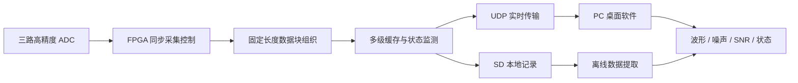

# 系统架构说明

## 项目目标

项目面向三通道高精度采集场景，目标是在 FPGA 内完成同步采集、数据块组织、实时网络发送、本地 SD 记录和状态诊断，并通过 PC 桌面软件完成设备控制、波形观察、噪声统计、SNR 显示和数据保存。

公开版本只展示系统级架构和工程方法，不展开完整 RTL、通信协议、寄存器流程、引脚约束或私有调试参数。

## 系统数据流



## FPGA 内部分层

```text
外设接口层
  ADC 数字接口
  RMII 以太网接口
  SD 卡 SPI 接口
  PPS/GPS 状态输入
  状态 LED

数据处理层
  三通道同步采样
  固定长度数据块组织
  缓存、溢出检测和状态汇总

传输与记录层
  局域网 UDP 实时链路
  SD 顺序记录链路
  PC 端解析、显示和保存
```

## 关键设计点

- 三通道采集必须保持采样点边界一致，只有三路数据条件满足后才形成完整采样点。
- 网络链路优先保证实时性，使用状态、序号和软件统计观察链路质量。
- SD 记录链路与实时网络链路并行工作，SD 异常不反压核心采集链路。
- PC 软件承担工程可视化：设备状态、采样参数、波形、真实 RMS、等效 RMS 噪声、SNR 和文件保存。
- FPGA 资源受限，因此缓存深度、片上 RAM 使用和状态机复杂度都需要做工程取舍。

## 调试闭环

```text
现象观察
  -> 状态字段定位
  -> 示波器 / 抓包 / 软件对照
  -> RTL 或约束修正
  -> 重新综合上板
  -> 长时间采集验证
```

典型问题包括网络 ARP 不通、ADC 同步异常、SD 初始化完成但写入失败、LED 状态误导、资源接近上限等。每类问题都通过状态上报、仪器测量和最小化修改逐步定位。

## 展示素材


