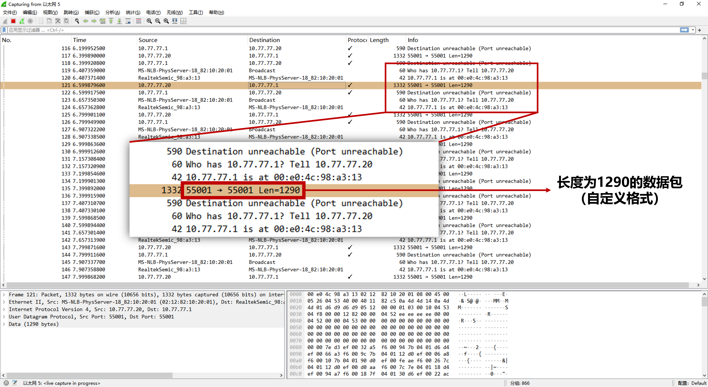
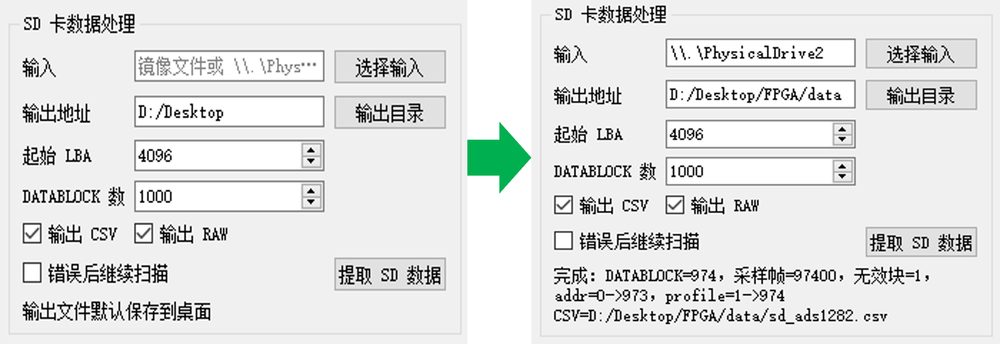
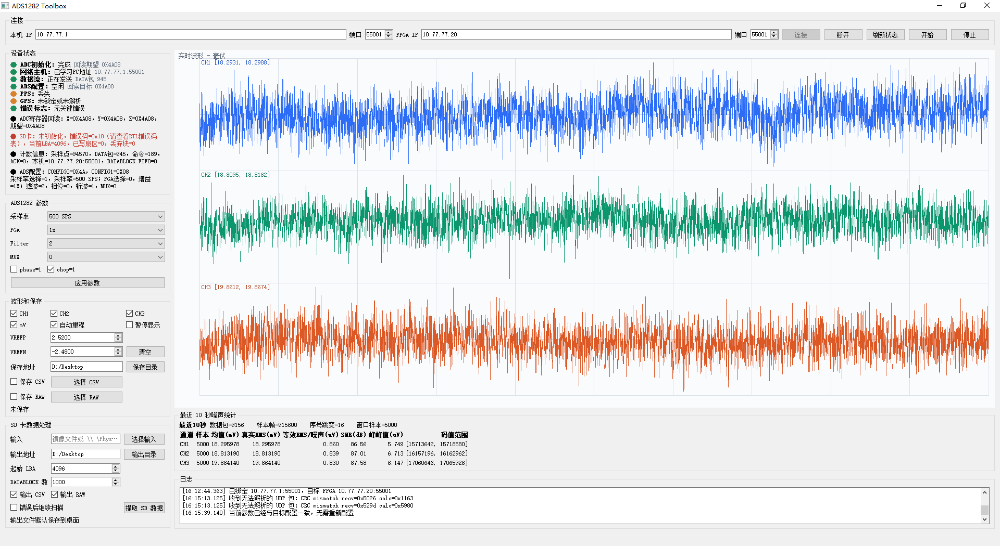

# FPGA 工程师面试展示版

## 一句话介绍

这是一个 Artix-7 FPGA 三通道高精度采集系统。我负责搭建 ADC 同步采集、数据块组织、UDP 实时传输、SD 本地记录、状态诊断、PC 软件联调和资源优化的完整闭环。

## FPGA 设计重点

- 三路 ADC 同步控制：共享关键控制信号，等待三路数据条件满足后再输出完整采样点。
- 固定长度数据块组织：将连续采样结果组织成适合网络和存储的二进制数据块。
- UDP 实时传输：FPGA 内实现轻量网络处理，用于低延迟实时采集。
- SD 本地记录：旁路监听同一数据流，异常时只上报状态，不反压核心采集链路。
- 跨时钟域处理：应用逻辑、网络 PHY 和外设状态之间使用 FIFO 或同步器隔离。
- 资源优化：在小容量 FPGA 上平衡 BRAM、LUT、FIFO 深度和连续采集需求。
- 可观测性：通过状态、LED、软件界面和测试脚本把内部状态外显。

## RTL 模块划分（脱敏描述）

| 层级 | 功能 | 设计关注点 |
|---|---|---|
| ADC 控制层 | 初始化、同步、读数、配置回读 | 时序约束、三通道一致性、异常恢复 |
| 数据组织层 | 采样点到固定数据块 | 字节序、块边界、计数连续性 |
| 缓存层 | 网络/存储前缓冲 | 满策略、溢出上报、资源占用 |
| 网络层 | 局域网实时传输和应用状态 | 主机学习、命令响应、持续发送 |
| SD 记录层 | SPI 初始化和顺序写入 | 写入响应、忙等待、错误处理 |
| 诊断层 | 状态、LED、软件状态 | 调试可观测性 |

## 关键工程问题与处理

### 三通道同步

三路 ADC 不是简单轮询读取，而是以同步条件为边界组织采样点。只有当三路数据都满足就绪条件时，才生成一个完整三通道样本；异常会进入状态上报，避免静默产生错位数据。

### 网络实时传输

网络链路选择 UDP，原因是采集系统更关注低延迟和持续流式输出。可靠性不靠复杂重传，而靠序号、状态、丢包统计和上位机保存策略来观测。这样 FPGA 内部协议处理更可控，资源消耗也更适合小器件。

### SD 记录不反压主链路

SD 卡写入延迟具有不确定性，所以 SD 记录链路不能拖慢 ADC 和网络主路径。设计上 SD 侧只监听数据块流，写慢时记录丢弃状态和计数，核心实时采集仍继续运行。

### 参数配置闭环

PC 软件可以发起参数修改。FPGA 侧不是只改寄存器变量，而是触发 ADC 重新配置、回读确认、短暂丢弃稳定样本，再恢复采集。软件最终以状态回读匹配作为成功条件。

### 资源优化

项目在 BRAM 资源上比较紧张。优化思路包括缩小过度保守的 FIFO、把小缓存转为分布式 RAM、保留关键 SD 缓冲、避免为了调试便利恢复大容量缓存。优化目标是保留后续扩展余量，而不是单纯追求最低资源。

## PC 软件联动

Qt 桌面软件用于查询设备状态、修改采样参数、实时显示三通道波形、统计均值、真实 RMS、等效 RMS 噪声、峰峰值和 SNR，并保存实时采集数据或处理 SD 记录数据。

## 面试官可能追问

### 为什么不用现成 TCP/IP 栈？

项目目标是实时采集和资源可控，UDP 足以满足低延迟传输。通过序号、状态和上位机统计可以观察丢包和缓存溢出，而不是把复杂可靠传输逻辑放进小容量 FPGA。

### 如何保证 CDC 安全？

多 bit 数据使用 FIFO 或明确握手机制，单 bit 事件使用同步器。网络 PHY 时钟域和应用采集时钟域分开处理，不直接跨域采样复杂总线。

### 如何处理 SD 卡写入慢？

SD 写入不反压 ADC 和网络主链路。如果 SD 忙或异常，会记录事件和计数，继续保证实时采集路径运行。这个取舍适合“实时观察优先、本地记录尽力而为”的阶段目标。

### 资源紧张时你怎么优化？

先看资源瓶颈类型。如果 BRAM 是瓶颈，就优先缩小大 FIFO、把小缓存改为分布式 RAM、减少重复缓冲；如果 LUT/FF 成为瓶颈，再考虑裁剪状态、命令和诊断功能。

## 公开版本保密边界

本材料不展示完整协议字段、状态机跳转表、寄存器配置流程、完整数据块布局、完整错误码表和关键 RTL 代码。公开时重点讲架构、方法和验证能力。
