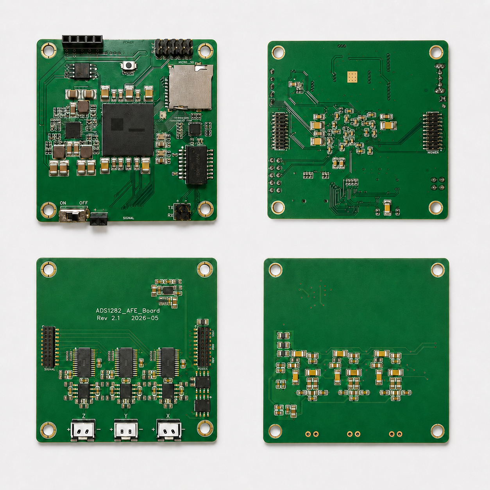
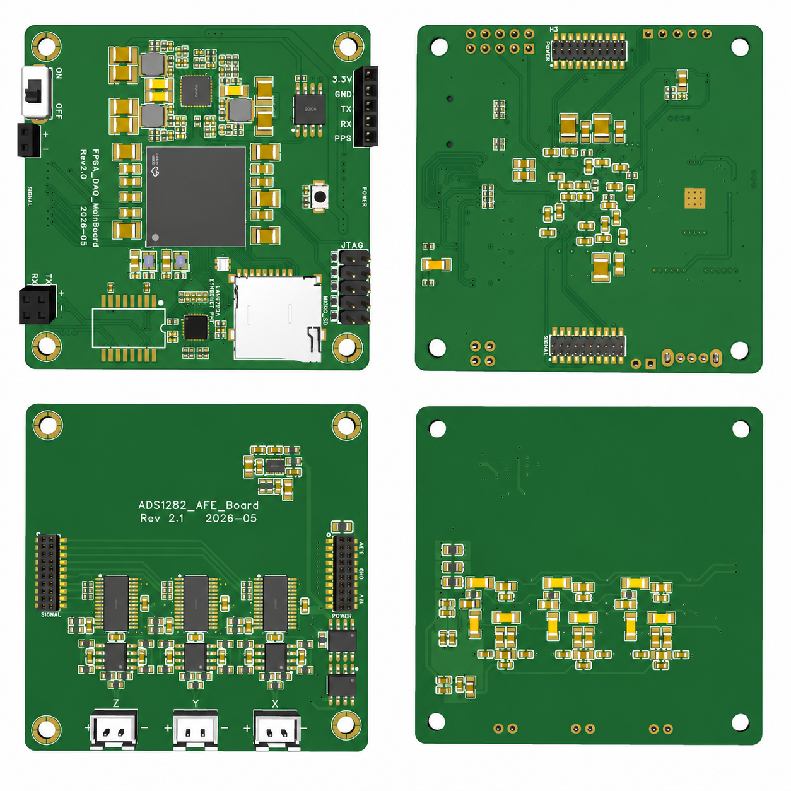

# 单板硬件工程师面试展示版

## 一句话介绍

这是一个 FPGA 主控的三通道高精度数据采集板级系统。我完成了从硬件接口理解、约束核对、上板联调、信号测量、网络与 SD 存储验证，到 PC 软件观察闭环的整体开发与调试。

## 与硬件岗位相关的能力点

- 根据网表、原理图和器件资料梳理板级接口，包括 ADC、以太网 PHY、SD 卡、PPS/GPS、复位、时钟和状态 LED。
- 将硬件连接落实到 FPGA 顶层接口和约束，并通过示波器、网络抓包和软件状态验证信号是否符合预期。
- 按电源、复位、时钟、接口、协议分层定位问题，避免把物理层问题误判成软件或协议问题。
- 在资源受限的小型 FPGA 上做工程取舍，避免为了缓存或调试便利过度占用片上资源。

## 硬件系统组成

| 子系统 | 公开描述 | 展示重点 |
|---|---|---|
| 高精度 ADC | 三路同步采集，FPGA 统一控制采样节奏 | 数字接口时序、同步信号、数据就绪验证 |
| 以太网 PHY | RMII 接口，局域网 UDP 实时传输 | PHY 复位、参考时钟、ARP/UDP 联调 |
| SD 卡 | SPI 模式，本地顺序记录采集数据 | 初始化、写入响应、异常码定位 |
| PPS/GPS | 预留时间同步与状态监测 | PPS 边沿检测、状态上报 |
| 状态 LED | 单线彩色 LED 显示系统状态 | 上电、错误、采集中状态验证 |
| PC 软件 | 波形、状态、噪声、SNR 和数据保存 | 板级调试可视化入口 |

## 板卡展示

## 调试与验证方法

### 时钟和复位

我首先确认 FPGA 核心时钟、PHY 参考时钟、ADC 主时钟和板上硬复位逻辑。复位不是简单接到所有模块，而是分时钟域同步后分别控制应用逻辑和外设释放时序，避免上电瞬间外设还没准备好就开始通信。

### ADC 数字接口

ADC 调试重点不是单纯“读到数据”，而是确认三路数据就绪是否同步、同步信号是否有效、采样时钟是否稳定、寄存器配置是否能回读匹配。通过状态上报和示波器信号对照，可以判断异常来自配置、数据就绪、数据读取还是后级打包。

### 以太网链路

网络问题按层拆解：先看 PHY 复位和参考时钟，再看 RMII 活动，再看 ARP，最后看 UDP 应用层。这个流程能避免把物理层问题误判成软件收包问题。

### SD 卡记录

SD 卡使用 SPI 模式。调试时重点观察初始化状态、写入响应、忙等待释放和错误状态。遇到写入失败时，不直接假设卡坏，而是结合命令响应和地址模式判断。

### 软件辅助硬件调试

桌面软件不是单纯上位机，而是硬件调试面板：能显示设备状态、ADC 配置回读、SD 状态、采样参数、实时波形、真实 RMS、等效 RMS 噪声和 SNR。这让很多板级问题可以从“现象”快速映射到“模块”。

## 面试官可能追问

### 你在硬件层面主要做了什么？

我不只是写 FPGA 逻辑，也把板级接口逐项核对：时钟、复位、ADC 数字接口、以太网 PHY、SD 卡、PPS/GPS 和 LED。每个外设都建立了可观察的状态反馈，便于上板时快速判断问题在哪一层。

### 如果网络不通，你怎么查？

我会按物理层到协议层排查：PHY 供电和复位、参考时钟、RMII 活动、ARP、UDP 应用层响应。这样可以避免一开始就陷入软件或协议细节。

### 如果 SD 初始化成功但不能写入，你怎么处理？

我会先看写入阶段响应，而不是只看初始化完成。SD 初始化完成只说明卡进入通信状态，不代表写入地址、容量识别和写入响应都正确。后续根据响应判断是地址模式、忙等待、数据响应还是卡状态问题。

## 公开版本保密边界

本材料不展示完整引脚表、网表、完整寄存器配置、完整协议字段和可复刻的调试参数。面试中可以讲方法和现象，不直接交付完整工程实现。
